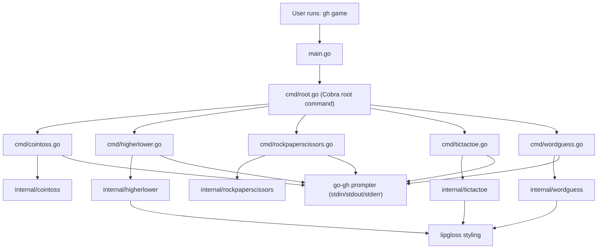
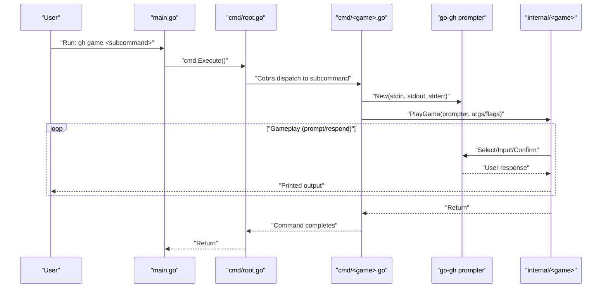

# gh-game Technical Specification

## Purpose

The `gh-game` project is a GitHub CLI extension that provides a collection of interactive terminal games exposed as `gh game <subcommand>`. Its primary purpose is to demonstrate how to build a GitHub CLI extension in Go while providing a set of small, self-contained games that run entirely in a local terminal session. The extension has no network-facing interface and does not require any GitHub API access for gameplay.

## High Level Architecture

At a high level, the project is a Go command-line application built with Cobra. A small `main` package delegates to a root Cobra command. Each game is implemented as a Cobra subcommand in `cmd/`, and the game logic lives in dedicated `internal/` packages. User interaction is performed via the GitHub CLI prompter API (`github.com/cli/go-gh/v2/pkg/prompter`), and output styling (colors/bold formatting) is done with Lip Gloss (`github.com/charmbracelet/lipgloss`).

The primary architectural separation is:

1. The CLI layer (`main.go` and `cmd/*`) is responsible for parsing arguments and flags, constructing a prompter wired to STDIN/STDOUT/STDERR, and then calling into a game package.
2. The game packages (`internal/<game>`) are responsible for the game state machine, game loop, random choice generation, and printing formatted gameplay output. Where useful, they define small interfaces (for example, a `Prompter` or `prompter` interface) so that tests can supply mocks.

The following diagram captures the runtime composition.



## Modules Brief

The codebase is organized into a small number of packages with clear responsibilities.

### Entry Point

The `main` package is a thin entrypoint that executes the Cobra root command.

Relevant file:
- `main.go`

Behavior:
- Calls `cmd.Execute()`.
- Prints any error to `os.Stderr`.
- Exits with status code `1` on failure.

### CLI Commands (Cobra)

The `cmd` package defines the root command and all game subcommands. Subcommands are registered via `init()` functions that attach them to the root command.

Relevant files:
- `cmd/root.go`
- `cmd/cointoss.go`
- `cmd/higherlower.go`
- `cmd/rockpaperscissors.go`
- `cmd/tictactoe.go`
- `cmd/wordguess.go`

Key responsibilities:
- Defines the CLI surface (command names, help text, flags, argument validation).
- Creates a `go-gh` prompter with `userPrompt.New(os.Stdin, os.Stdout, os.Stderr)`.
- Delegates execution to the corresponding `internal/*` package.

Notable behaviors:
- `cointoss` validates the single required argument (`heads` or `tails`) via `internal/cointoss.ValidateGuess`.
- `higherlower` defines `--min/-m` and `--max/-M` flags and passes the range into the game loop.
- `rockpaperscissors` defines a `--spock` boolean flag enabling the extended “secret mode”.
- `tictactoe` runs a CLI-driven loop in the command itself and calls into `internal/tictactoe` for move selection, game state, and AI move generation.
- `wordguess` delegates to `internal/wordguess.PlayGame`.

### Game Logic Packages (internal/*)

Each game has an `internal/<game>` package containing state, rules, and the main gameplay loop. These packages generally print directly to standard output and depend on a small prompter interface so tests can provide a mock prompter.

#### internal/cointoss

Relevant file:
- `internal/cointoss/cointoss.go`

Responsibilities:
- Validates initial guess (`heads`/`tails`).
- Maintains a streak counter as long as guesses are correct.
- Uses a `TossCoin` function variable so tests can override randomness.
- Requests subsequent guesses using a `Select` prompt with `Heads`, `Tails`, and `Quit`.

#### internal/higherlower

Relevant file:
- `internal/higherlower/higherlower.go`

Responsibilities:
- Runs a streak-based guessing loop, ending on an incorrect guess or when the next number matches the current number.
- Supports configurable number ranges via `minNumber` and `maxNumber`.
- Formats output using Lip Gloss styles.
- Uses `DefaultGenerateNumber` as a variable so tests can control randomness.

#### internal/rockpaperscissors

Relevant file:
- `internal/rockpaperscissors/rockpaperscissors.go`

Responsibilities:
- Plays a best-of series where the number of rounds is chosen via a select prompt.
- Tracks player and CPU scores and ends when the series is complete.
- In secret mode, expands choices to include `lizard` and `spock`.
- Uses `math/rand` for computer choice selection.

#### internal/tictactoe

Relevant file:
- `internal/tictactoe/tictactoe.go`

Responsibilities:
- Provides a game state (`Game`) with a 3x3 board and winner/draw detection.
- Supports `LocalGame` and `ComputerGame` modes.
- Provides `GetPlayerMove` to prompt for a position using selectable available positions.
- Provides an AI move selector (`GetComputerMove`) using a simple strategy (try to win, block, center, corner, then any space).
- Formats board output with Lip Gloss styles.

Note that the command layer (`cmd/tictactoe.go`) hosts the main interactive loop and uses methods on `internal/tictactoe.Game` for validation and winner/draw detection.

#### internal/wordguess

Relevant file:
- `internal/wordguess/wordguess.go`

Responsibilities:
- Picks a random word from `WordList`.
- Tracks revealed word state, guessed letters, and incorrect guesses.
- Prints a formatted game view using Lip Gloss styles.
- Requests letter guesses via prompter `Input`.
- Uses prompter `Confirm` to ask if the user wants to play again, and restarts by recursively calling `PlayGame(p)` when confirmed.

## Sequence Diagram

The following sequence diagram shows a typical flow for invoking a game command. The same overall structure applies across games: the Cobra command creates a prompter and then hands control to an `internal/*` package (or, for tic-tac-toe, runs a loop that calls `internal/tictactoe` methods).



## Technical Stack

The implementation uses the following main technologies:

- Go (module-based project; `go.mod` declares `go 1.25.0`).
- Cobra (`github.com/spf13/cobra`) for CLI command structure and flag parsing.
- GitHub CLI extension integration via `go-gh` prompter (`github.com/cli/go-gh/v2/pkg/prompter`) for interactive prompts.
- Lip Gloss (`github.com/charmbracelet/lipgloss`) for terminal styling and colored output.
- Standard library packages such as `fmt`, `os`, `math/rand`, `time`, and `strings`.

## 3rd Party Libraries/Dependencies

The primary direct dependencies (from `go.mod`) are:

- `github.com/spf13/cobra` for command definition and execution.
- `github.com/cli/go-gh/v2` for GitHub CLI integration and prompting.
- `github.com/charmbracelet/lipgloss` for terminal text styling.

The project also brings in several indirect dependencies through these libraries, including:

- `github.com/AlecAivazis/survey/v2` (indirect), which is commonly used under the hood for interactive prompting.
- Terminal capability and styling support libraries used by Lip Gloss and related packages.

For the authoritative list (including exact versions), refer to:
- `go.mod`
- `go.sum`

## Logger Used

There is no dedicated structured logging framework in use. The project prints user-facing messages and error messages directly to standard output and standard error using:

- `fmt.Println`, `fmt.Printf` within game packages for gameplay output and prompt errors.
- `fmt.Fprintln(os.Stderr, err)` in `main.go` for top-level command execution errors.

As a result, output is primarily designed for interactive terminal use rather than machine parsing.

## Deployment and Usage Manual

### Installation (as a GitHub CLI extension)

The README documents installation via GitHub CLI:

```sh
gh extension install github-samples/gh-game
```

This installs the extension so it can be invoked as `gh game ...` (depending on how the extension is configured by GitHub CLI).

### Local Build (development)

From the repository root (`gh-game-2273/`):

1. Build the binary:

```sh
go build
```

2. Run tests:

```sh
go test ./...
```

The codebase is organized as a standard Go module. No additional runtime services are required.

### Usage

The extension is invoked as:

```sh
gh game <command> [args] [flags]
```

Implemented commands and examples include:

1. Coin Toss

```sh
gh game cointoss heads
gh game cointoss tails
```

2. Higher or Lower

```sh
gh game higherlower
gh game higherlower --min 1 --max 1000
```

3. Rock Paper Scissors

```sh
gh game rockpaperscissors
gh game rockpaperscissors --spock
```

4. Tic Tac Toe

```sh
gh game tictactoe
```

5. Word Guess

```sh
gh game wordguess
```

### Operational Notes

This is an interactive terminal application:

- It requires a TTY-like environment where prompts can be displayed and answered.
- It reads from standard input and writes to standard output; errors may also be printed to standard error.
- Random behavior is driven by `math/rand`. Some packages seed randomness via `time.Now().UnixNano()` (for example, `internal/higherlower` uses a local source; other games use the default global source).

For the most accurate command list and help text, run:

```sh
gh game --help
gh game <command> --help
```
